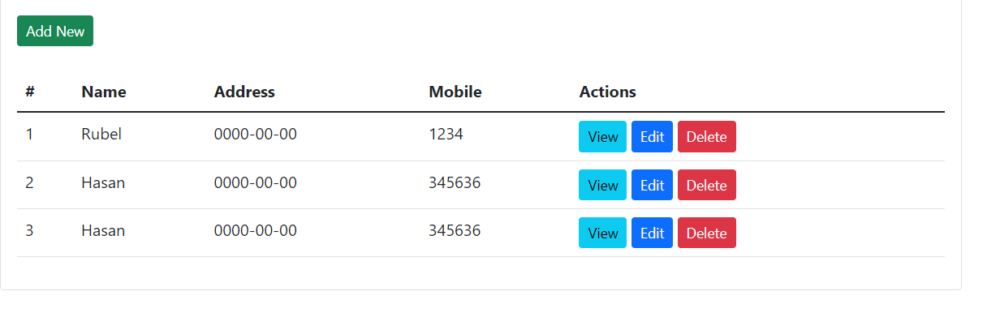

# crud-application

In this project I just tried to build a simple crud operation on laravel.
# Description

Welcome to the Iris Flower Species Classification repository. In this project, we dive into the fascinating world of machine learning by working with the Iris flower dataset. This dataset comprises three distinct species: setosa, versicolor, and virginica. These species are discernible based on specific measurements.

# Project Objective

Imagine having a collection of Iris flower measurements, each categorized by its respective species. Our mission is clear: develop a robust machine learning model capable of learning from these measurements and accurately classifying Iris flowers into their correct species. This project showcases the power of supervised learning and classification in real-world applications.

# Key Features

Utilizes Python and popular machine learning libraries.
Implements data preprocessing, model training, and evaluation.
Demonstrates classification techniques to distinguish Iris species.
Visualizes data and model performance for comprehensive analysis.
Offers insights into feature importance for accurate classification.
Encourages experimentation with different classification algorithms.

# Getting Started

Clone the repository: git clone https://github.com/robiul-islam-rubel/Internship_Iris-flower-classification.git
Explore Jupyter notebooks for data exploration, model building, and analysis.
Customize model hyperparameters and try various classification techniques.
Gain insights into feature importance for accurate species classification.

# Contributions

Contributions are welcome! Fork the repository, enhance the project, and create pull requests to contribute to this educational endeavor.

# Disclaimer

While this project showcases the potential for accurate species classification, it's essential to recognize that real-world botanical classification can involve more complex factors. Always seek expert guidance for critical botanical classifications.

